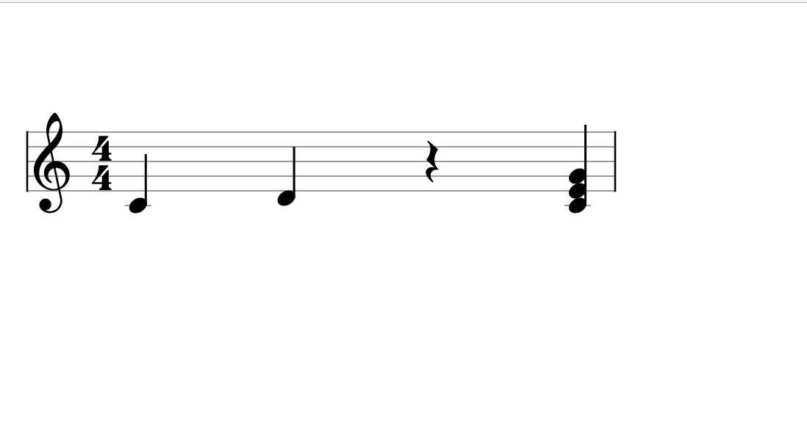

# js verxflow



## Setup
```bash
$ nodenv install
$ npm install
$ npm start
$ open http://localhost:8080
```
## Refer to

* [0xfe/vexflow: A JavaScript library for rendering music notation and guitar tablature.](https://github.com/0xfe/vexflow)
